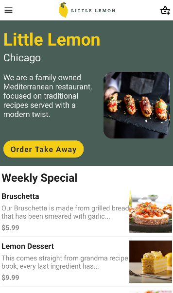
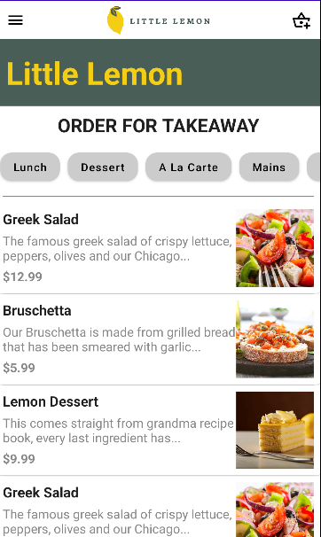

# LittleLemon-FoodOrderingApp

An educational project for a food ordering app built with Android and Compose UI.

## Screenshots

### Main Screen

### Order Screen

## Features

- Displays a weekly special menu.
- Users can scroll through the available menu items.
- Button "Order Takeaway" navigates to the order screen.
- Order screen displays various categories (Lunch, Dessert, etc.) with scrollable menu.

## Installation

1. Clone the repository:

git clone https://github.com/danasloc/LittleLemon-FoodOrderingApp.git

2. Open the project in Android Studio.

3. Build and run the project on an Android emulator or a physical device.

## License

This project is licensed under the MIT License.
